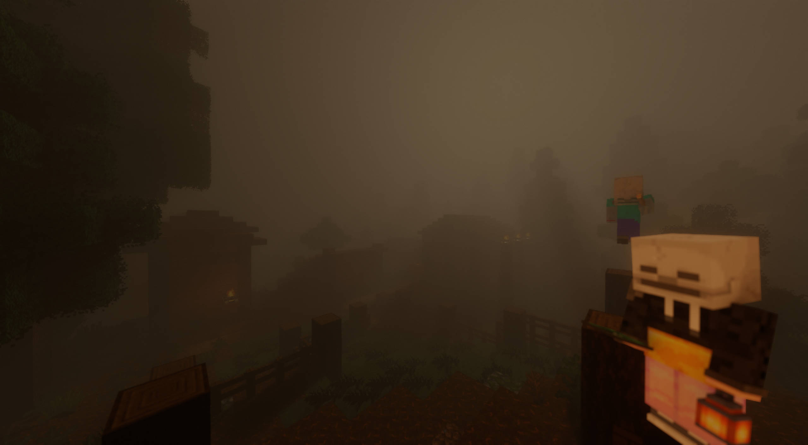
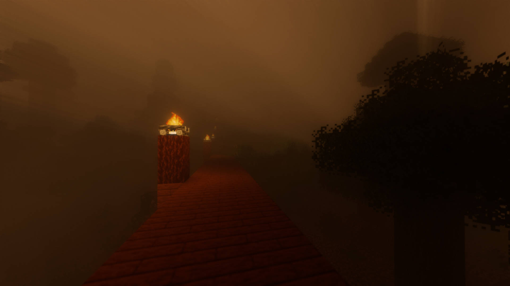
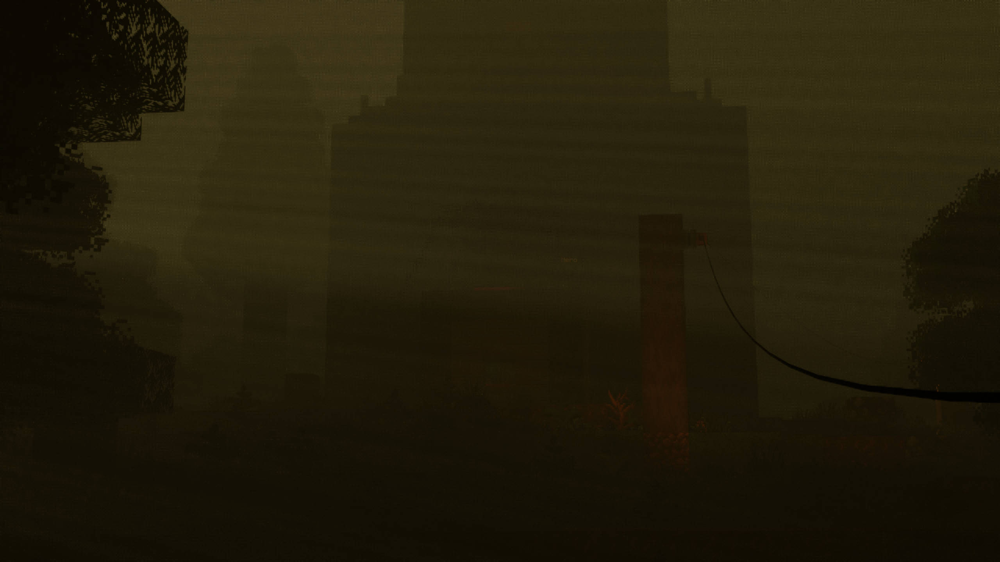

# Shaders for DreadReimagined
DreadReimagined is Minecraft modpack: a fork of [DREAD](https://www.curseforge.com/minecraft/modpacks/dread-arrenek/) by [Arrenek](https://www.curseforge.com/members/arrenek).

This shaderpack is based on [Chocapic13' Shaders](https://www.curseforge.com/minecraft/shaders/chocapic13-shaders/) and adapted for Iris.

These are the shaders used in DreadReimagined. The modpack is not yet available.

## Gallery

